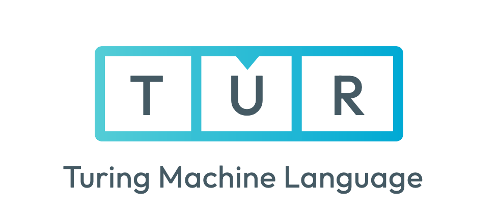

# Tur - Turing Machine Language

[](https://crates.io/crates/tur) [](https://docs.rs/tur) [](https://github.com/rezigned/tur/actions/workflows/ci.yml)

<p align="center">
  
</p>

**Tur** is a language for defining and executing Turing machines, complete with parser, interpreter, and multi-platform visualization tools. It supports both single-tape and multi-tape configurations.

<table>
  <thead>
    <tr>
      <th width="500px">Web</th>
      <th width="500px">TUI</th>
    </tr>
  </thead>
  <tbody>
    <tr>
      <td>
        <a href="https://rezigned.com/tur"></a>
      </td>
      <td>
        
      </td>
    </tr>
  </tbody>
</table>

## Language Overview

Tur (`.tur` files) provides a clean, readable syntax for defining both single-tape and multi-tape Turing machines. The language includes:

- **Declarative syntax** for states, transitions, and tape configurations
- **Multi-tape support** with synchronized head movements
- **Built-in validation** and static analysis
- **Cross-platform execution** via CLI, TUI, and web interfaces

## Syntax Examples

### Single-Tape Turing Machine

```tur
name: Binary Counter
tape: 1, 0, 1, 1
rules:
  start:
    0 -> 0, R, start
    1 -> 1, R, start
    _ -> _, L, inc   # Reached end, go back to start incrementing
  inc:
    0 -> 1, S, done  # 0 becomes 1, no carry needed
    1 -> 0, L, inc   # 1 becomes 0, carry to next position
    _ -> 1, S, done  # Reached beginning with carry, add new 1
  done:
```

### Multi-Tape Turing Machine

```tur
name: Copy Tape
tapes:
  [a, b, c]
  [_, _, _]
rules:
  copy:
    [a, _] -> [a, a], [R, R], copy
    [b, _] -> [b, b], [R, R], copy
    [c, _] -> [c, c], [R, R], copy
    [_, _] -> [_, _], [S, S], done
  done:
```

## Language Specification

### Program Structure

Every `.tur` program consists of:

```tur
name: Program Name

# Single-tape configuration
tape: symbol1, symbol2, symbol3
head: 0  # optional, defaults to 0

# OR multi-tape configuration
tapes:
  [tape1_symbol1, tape1_symbol2]
  [tape2_symbol1, tape2_symbol2]
heads: [0, 0]  # optional, defaults to [0, 0, ...]

# Optional blank symbol (defaults to ' ')
blank: ' '

# Transition rules
rules:
  state_a:
    input -> output, direction, next_state
    # ... more transitions
  state_b:
    # ... transitions
```

> [!NOTE]
> The first state defined in the `rules:` section is automatically considered the start state. In the examples above, `state_a` is the initial state because it appears first.

### Transition Rules

**Single-tape format:**
```tur
current_symbol -> write_symbol, direction, next_state
```

**Multi-tape format:**
```tur
[sym1, sym2, sym3] -> [write1, write2, write3], [dir1, dir2, dir3], next_state
```

### Directions

- `L` or `<` - Move left
- `R` or `>` - Move right
- `S` or `-` - Stay (no movement)

### Comments

```tur
# This is a comment
state:
  a -> b, R, next  # Inline comment
```

### Special Symbols

- The underscore (`_`) is a special symbol used to represent a blank character in program definitions.
- Any other character or unicode string can be used as tape symbols.
- The blank symbol can be customized using the `blank:` directive in the program.

## Platforms

### Command Line Interface (CLI)

```bash
# Run a program
cargo run -p tur-cli -- examples/binary-addition.tur

# Pipe input to a program
echo '$011' | cargo run -p tur-cli -- examples/binary-addition.tur

# Chaining programs with pipes
echo '$011' | cargo run -p tur-cli -- examples/binary-addition.tur | cargo run -p tur-cli -- examples/binary-addition.tur
```

### Terminal User Interface (TUI)

```bash
# Interactive TUI with program selection
cargo run --package tur-tui
```

## Documentation

- **API Documentation**: [docs.rs/tur](https://docs.rs/tur)
- **Repository**: [github.com/rezigned/tur](https://github.com/rezigned/tur)
- **Examples**: See the `examples/` directory for sample `.tur` programs

## License

- MIT License ([LICENSE](LICENSE))
